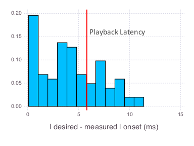

# Weber

[](https://travis-ci.org/haberdashPI/Weber.jl)

[](https://coveralls.io/github/haberdashPI/Weber.jl?branch=master)

[](http://codecov.io/github/haberdashPI/Weber.jl?branch=master)

# About

Weber can be used to generate simple pscyhology experiments that present visual
and auditory stimuli at precise times. The emphasis is currently on auditory
psychophysics, but the package has the features necessary to generate most
visual stimuli one would desire as well. It is named after Ernst Weber. Weber
runs on Windows and Mac OS X, and supports keyboard input or Cedrus response-pad
input.

It should be very easy to port this to linux, I just don't have
linux currently installed to test for proper installation of SDL2, and so I
haven't gotten around to this.


# Installation

```julia
julia> Pkg.clone("https://github.com/haberdashPI/Weber.jl")
julia> Pkg.build("Weber")
```

# Usage

The following is a simple example to help demonstrate the basic features of the
package. Refer to the examples directory for several, more realistic, real-world
examples.

```julia
using Weber
sid,skip = @read_args("A simple frequency discrimination experiment.")

low = sound(ramp(tone(1000,0.5)))
high = sound(ramp(tone(1100,0.5)))
 
function one_trial()
  if rand(Bool)
    stim = moment(0.5,t -> play(low))
    resp = response(key"q" => "low", key"p" => "high",actual = "low")
  else
    stim = moment(0.5,t -> play(high))
    resp = response(key"q" => "low", key"p" => "high",actual = "high")
  end
  return [show_cross(),stim,resp,await_response(iskeydown)]
end
 
exp = Experiment(sid = sid,condition = "ConditionA",skip=skip,columns=[:actual])
setup(exp) do
  addbreak(instruct("Here are some instructions."))
  addbreak(instruct("Here's some practice."))
  for i in 1:5
    addpractice(one_trial())
  end
  
  addbreak(instruct("Here's the real deal."))
  for trial in 1:60
    addtrial(one_trial())
  end
end

run(exp)
```

This experiment records responses to a simple frequency discrimination
experiment. After 500ms from the start of each trial, a low or high tone is
played that lasts 500ms. At some point after the start of the tone the
listener needs to hit 'q' if they hear the low tone and 'p' if they hear the
high tone. There's no feedback, ever.

Let's step through the code:

```julia
using Weber
sid,skip = @read_args("A simple frequency discrimination experiment.")
```

This loads Weber, and reads two important parameters from the user, the
subject id, and how many _offsets_ to skip. You don't have to worry about
offsets right now. If you wish to learn about them refer to the documentation
for `@read_args`, `addtrial` and `Experiment`.

```julia
low = sound(ramp(tone(1000,0.5)))
high = sound(ramp(tone(1100,0.5)))
```

This generates the low (1000 Hz) and high (1100 Hz) tone. In addition to `ramp`
and `tone` there are many other function to help you generate sounds (`mix`,
`mult`, `silence`, `noise`, `highpass`, `lowpass`, `bandpass`, `tone`, `ramp`,
`harmonic_complex`, `attenuate`). Any aribtrary single dimensional array (or 2d for stereo
sound) can be used as a sound stimulus, and anything you can do to an array you
can do to a sound stimiulus. You can also load sounds from a wav file using
`load`. Refer to the documentation of these individual functions for
details. Generally you should create the sounds prior to running an experiment,
as shown here, to minimize latency. If these functions are insufficient you may
also want to take a look at the `SampledSignals` and `DSP` packages which Weber
draws from. 

Once you are done generating a stimulus, you need to call `sound` (as shown above) so
that it can be presented to the subject by Weber using the `play`
function. The play function will return an object that you can call `pause` or
`stop` on.

```julia
function one_trial()
  if rand(Bool)
    stim = moment(0.5,t -> play(low))
    resp = response(key"q" => "low", key"p" => "high",actual = "low")
  else
    stim = moment(0.5,t -> play(high))
    resp = response(key"q" => "low", key"p" => "high",actual = "high")
  end
  return [show_cross(),stim,resp,await_response(iskeydown)]
end
```

This function will be used below to create each trial of the experiment. It does
this by returning several **moments**. Moments are relatively brief events
intended to occur at a precise time during a trial. They are the basic building
blocks of trials. There are many ways to create moments: please refer to the
documentation for `addtrial` for a complete list of available moment types, and
some guidlines about creating low-latency moments. In the above, the function
`moment`, `response` and `await_resposne` are functions that generate a kind of
moment. The call to `moment` is used to present the tone (e.g. `play(low)`). The
`response` moment records all presses of 'q' and 'p' to a data file stored in
the a subdirectory called data. The `await_response` moment waits until the user
presses any key before moving on to the next moment (in this case, the end of
the trail).

The `response` function uses the macro `key"str"` to reference keyboard keys.
Look up the documentation for `@key_str` for more details. There are
several lower-level functions for working with user input as well. Look at the
description of watchers in the documentation of  `addtrial`, and refer
to the event processing methods `time`, `response_time`, `keycode`, `iskeydown`
`iskeyup`, `reset_response`, `isfocused` and `isunfocused`.

```julia
exp = Experiment(sid = sid,condition = "ConditionA",skip=skip,columns=[:actual])
```

This call creates the actual experiment, indicating that the subject id and
condition should be recorded on each line of the data file. Refer to the
documentation of `Experiment` for more options when creating an experiment.

The `columns=[:actual]` tells Weber that the data file should have a column
called "actual". The call to record `response`, during the function `one_trial`,
sets this column to "low" or "high" depending on which tone was actually played
to the subject. If `:actual` was not specified here, this call would result in
an error during the experiment.

```julia
setup(exp) do
  addbreak(instruct("Here are some instructions."))
  addbreak(instruct("Here's some practice."))
  for i in 1:5
    addpractice(one_trial())
  end
  
  addbreak(instruct("Here's the real deal."))
  for trial in 1:60
    addtrial(one_trial())
  end
end
```

This section of the program is the where all trials of the experiment are
actually created. It adds several breaks, which can be used to give the subject
useful information or let them rest. Then it adds 5 practice trials, and a total
of 60 actual trials. Weber will automatically record the trial number for
each trial (added using `addtrial`) on each line of the resulting data
file. Both trials and practice trials also increment a second number
recorded to the data file, called the offset.

Note that the experiment has not actually been run after this code has completed
running, it is merely ready to begin. Normally experiments have a fixed number
of trials specified during setup, as shown here, but if you wish to do more
advanced types of experiments with some aribtrary number of trials, refer to the
documentation for `addtrial`.

```julia
run(exp)
```

Once you have created the experiment you need to actually run it by calling
`run`. This organization helps ensure that as much as possible is
computed before the experiment is actually run. The only code that executes
during `run` are the functions called inside the moments, such as the call to
`play(low)` in `one_trial`. Everything else happens during the setup.

There are several features this experiment does not demonstrate, visual stimuli
and higher level primitives.

You can create visual stimuli by using `load` to open images or create a 2d
array (for grayscale) or 3d array (for color) representing pixel data. You can
then use `visual` to preapre them for display (analogous to `sound`) and
`display` to show them to the subject. The function `visual` can also be used to
render text to the screen.

There is also an `addbreak_every` primitive not demonstrated here that adds a
break every N trials. Refer to its documentation for details. Future Pyschotask
versions will probably include many more such primitives to simplify the
creation of experiments.

# Status

This is working for my own purposes, and I am running pilot experiments in it
now. I am in the processing of validating the timing of experiments, and
implementing tests to avoid regressions.

## Timing Accuracy

The empirical timing error of audio playback, at ~6.48ms (= 75th percentile of
absolute differences), is close to the theoretically minimal error rate of
~5.80ms. A histrogram of event onset errors is displayed below. The theortical
minimum is determiend by the buffer size of audio playback, because this buffer
introduces playback latency. By default the buffer size is 256 samples, leading
to a latency of up to ~5.80ms (= 256/44100). I chose this default value because
it seems to play sound without corruption across a variety of hardware and
operating systems.  You can reduce the buffer size for playback up to the limits
of your hardware using `setup_sound`. This can reduce the emprical timing
error.



Note that this level of accuracy is only achieved when moments (e.g. as created
by `moment`) occur when they are intended to occur. Weber will notify you
when it is failing to accurately present moments. Such accuracy is probably only
possible if you follow the guidelines provided in `addtrial` for generating well
timed events. Note that timing is usually poor when the experiment first starts.

This error estimate is only relevent when you *start* playing a
sound. If you want more precise timing between two sounds you can simply create
a single sound composed of those two sounds with an appropriate silence between
them. Then the timing error will be rouhgly equal to the recipricol of the
sampling rate (1/44100 s).

You can re-run this same test of auditory playback timing and generate a new
graph for your computer, using test/audiotiming.jl and
test/analyze_audiotiming.jl.

## Roadmap

For the 0.2.0 release
- [x] document object composition
- [x] document moment composition
- [x] document experiment construction
- [x] document primitives.jl
- [x] create a basic usage guidelines in README.

- [x] allow resetting of Cedrus response timer
- [x] debug (or remove) harmonic_complex
- [x] test responses to Cedrus XID devices (create example for reading buttons)
- [x] test `play` timing (using a microphone)
- [ ] test `display` timing (using a video camera)
- [ ] to help prevent regressions, create tests to check on timing
      as reported by record events.

- [ ] submit the package to METADATA.jl
- [x] use the version number of Weber.jl indicated by Pkg

For the 0.3.0 release
- [ ] edit/refine the user manual
- [ ] create 2AFC abstraction
- [ ] create examples to demonstrate all package features
- [ ] allow calls to Cedrus stim tracker??
- [ ] replace interactive text input with simple Gtk window or SDL based GUI??
- [ ] support linux (get BinDeps working for installation)

For the 0.4.0 release?
- [ ] video playback
